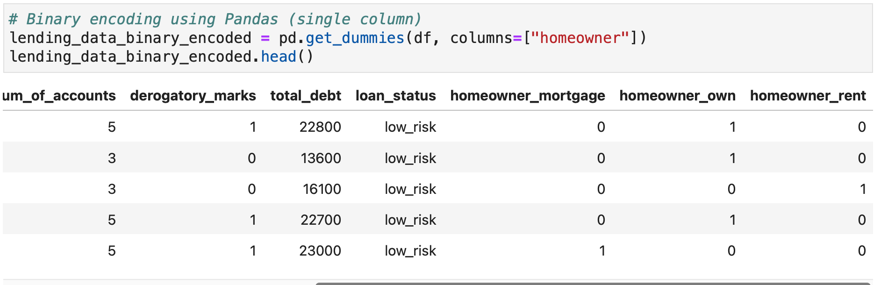

# 11_Risky_Business
Build and evaluate several machine learning models to predict credit risk using data you'd typically see from peer-to-peer lending services.Employ different techniques for training and evaluating models with imbalanced classes. Use the imbalanced-learn and Scikit-learn libraries to build and evaluate models using the two following techniques: 1)Resampling 2) Ensemble Learning

The data in the dataframe was encoded using pd.to_dummies to get the data in form that is understood by the classification models
 

The notebook does the below steps

1. Read the CSV into a DataFrame.

2. Split the data into Training and Testing sets.

3. Scale the training and testing data using the `StandardScaler` from `sklearn.preprocessing`.

4. Use the provided code to run a Simple Logistic Regression:
    * Fit the `logistic regression classifier`.
    * Calculate the `balanced accuracy score`.
    * Display the `confusion matrix`.
    * Print the `imbalanced classification report`.

5. Oversample the data using the `Naive Random Oversampler` and `SMOTE` algorithms.

6. Undersample the data using the `Cluster Centroids` algorithm.

7. Over- and undersample using a combination `SMOTEENN` algorithm.

For each of the above

1. Train a `logistic regression classifier` from `sklearn.linear_model` using the resampled data.

2. Calculate the `balanced accuracy score` from `sklearn.metrics`.

3. Display the `confusion matrix` from `sklearn.metrics`.

4. Print the `imbalanced classification report` from `imblearn.metrics`.

1. Which model had the best balanced accuracy score?

   ***The SMOTE/SMOTEENN model has the best accuracy score of 0.9948279972279972 (exactly same)***

2. Which model had the best recall score?

    ***All of the models have the same recall score of 0.99***

3. Which model had the best geometric mean score?

    ***All of the models have a good geometric mean score of 0.99***

### Ensemble Learning

Train and compare two different ensemble classifiers to predict loan risk and evaluate each model. 
Use the [Balanced Random Forest Classifier](https://imbalanced-learn.org/stable/references/generated/imblearn.ensemble.BalancedRandomForestClassifier.html) and the [Easy Ensemble Classifier](https://imbalanced-learn.org/stable/references/generated/imblearn.ensemble.EasyEnsembleClassifier.html)

1. Read the data into a DataFrame using the provided starter code.

2. Split the data into training and testing sets.

3. Scale the training and testing data using the `StandardScaler` from `sklearn.preprocessing`.

Then, complete the following steps for each model:

1. Train the model using the quarterly data from LendingClub provided in the `Resource` folder.

2. Calculate the balanced accuracy score from `sklearn.metrics`.

3. Display the confusion matrix from `sklearn.metrics`.

4. Generate a classification report using the `imbalanced_classification_report` from imbalanced learn.

5. For the balanced random forest classifier only, print the feature importance sorted in descending order (most important feature to least important) along with the feature score.

Use the above to answer the following questions:

1. Which model had the best balanced accuracy score?

    ***The Easy Ensemble Classifier has a better balance accuracy score of 0.9259823295502616 vs the Balanced Random Forest Classifier which had the balance accuracy score of 0.7223058204511484***

2. Which model had the best recall score?

    ***The recall score of Balanced Random Forest Classifier is higher i.e 0.96 than Easy Ensemble Classifier which has recall score of 0.94. The higer recall score might be better in case we want to be risk averse and further analyse false positives***

3. Which model had the best geometric mean score?

    ***The geometric score of Easy Ensemble Classifier is better i.e 0.93 as compare to Balanced Random Forest Classifier which as geometric score of 0.68***

4. What are the top three features?

    ***The top 3 features based on feature importance from Balanced Random Forest Classifier are as follows***
    1) Total received priciple
    2) Last Payment amount
    3) total payment invoice
    Result - 
      - (0.13358385419997146, 'total_rec_prncp'),
      - (0.1282232009028145, 'last_pymnt_amnt'),
      - (0.12092286830085001, 'total_pymnt_inv'),

